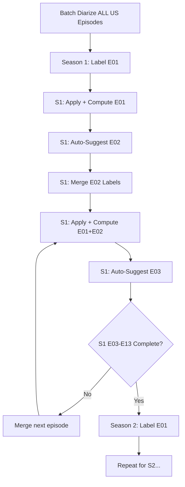

# Speaker Labeling & Voice Embeddings

## Quick Start (TL;DR)

**Batch diarization across all episodes (US, AU, NZ, SA versions):**

```bash
# Diarize ALL episodes for a specific version at once
pipenv run python scripts/diarization_pipeline.py --season US
```

**Per-season sequential processing (repeat for each season):**

```bash
# 1. Manually label Episode 1
# Edit: data/manual_labels/survivor_speaker_labels.csv
# Format: version_season,episode,speaker_label,castaway_id,castaway,confidence,notes
# Example: US01,1,SPEAKER_0,US01jeffp01,Jeff Probst,high,Host

# 2. Apply labels + compute E01 embeddings + auto-suggest E02
pipenv run python scripts/manage_speaker_labels.py full-workflow --season 1

# 3. Review auto-suggestions for Episode 2
cat data_cache/survivor_embeddings/US01_auto_suggestions.csv

# 4. Merge approved E02 labels into CSV, re-run full-workflow
# (now E03 suggestions use E01+E02 embeddings)

# 5. Repeat sequentially for E03-E13
# Each episode benefits from growing embedding reference library
```

**Key Architecture:**
- **Batch diarization:** All episodes of a version processed in parallel (fast!)
- **Sequential labeling:** Episodes processed in order within each season (E02 uses E01, E03 uses E01+E02, etc.)
- **Growing reference:** Embedding library improves with each labeled episode

**First time?** Read the full guide below for concepts and troubleshooting.

---

## Overview

This guide covers the **speaker identification workflow** for Survivor episode diarization. After running the base diarization pipeline (see [Diarization Implementation](diarization_implementation_summary.md)), you can manually label speakers and use voice embeddings to propagate those labels across episodes.

**Quick Summary:**
1. **Run diarization** on all episodes of a season (creates clusters like SPEAKER_0, SPEAKER_1)
2. **Manually label** Episode 1 speakers (SPEAKER_0 = "Jeff Probst", etc.)
3. **Compute embeddings** to create voice "fingerprints" for each labeled speaker
4. **Auto-suggest labels** for Episodes 2+ using embedding similarity
5. **Review and refine** iteratively until all speakers are labeled

**Key Insight:** Pyannote assigns arbitrary cluster numbers, so Jeff Probst might be SPEAKER_0 in Episode 1 but SPEAKER_7 in Episode 2. Voice embeddings solve this by matching voices across episodes regardless of cluster number.

---

## Problem: Inconsistent Speaker Numbering

Pyannote.audio assigns speaker cluster IDs (`SPEAKER_0`, `SPEAKER_1`, etc.) **independently for each episode**:

- Episode 1: Jeff Probst = `SPEAKER_0`, Richard Hatch = `SPEAKER_1`
- Episode 2: Jeff Probst = `SPEAKER_7`, Richard Hatch = `SPEAKER_3`

Same people, different cluster IDs! This is where **voice embeddings** come in.

## Solution: Embedding-Based Label Propagation

Voice embeddings create a numerical "fingerprint" of each speaker's voice. By comparing embeddings across episodes **within a season**, we can identify that Episode 2's `SPEAKER_7` matches Episode 1's `SPEAKER_0` (Jeff Probst).

**Architecture:**
- **Episode-level embeddings**: Stored per episode-cluster, used for sonic features and matching
- **Season-level centroids**: Aggregated embeddings per castaway per season, used for speaker identification
- **Cross-season stacking**: Optional - combine Jeff Probst embeddings across all seasons for host identification

---

## Workflow

### Recommended Workflow for Multi-Season Processing

**Efficient batch diarization + sequential labeling:**



**Phase 1: Batch Diarization (Once per Version)**
1. Diarize ALL episodes for US Survivor: `--season US` (or AU, NZ, SA)
2. Creates SPEAKER_0, SPEAKER_1, etc. for every episode
3. No labels yet, all marked as `castaway='UNKNOWN'`

**Phase 2: Per-Season Sequential Processing**
4. **Season 1, Episode 1:** Manually label all speakers in CSV
5. **Season 1, Episode 1:** Run `full-workflow` (apply + compute + suggest for E02)
6. **Season 1, Episode 2:** Review E02 auto-suggestions, merge approved labels into CSV
7. **Season 1, Episode 2:** Run `full-workflow` again (now E03 uses E01+E02 embeddings)
8. **Season 1, Episodes 3-13:** Repeat sequentially (each benefits from growing reference library)
9. **Season 2:** Start fresh with Episode 1 manual labeling (different cast!)

**Phase 3: Only Process Seasons with Manual Labels**
10. If running multi-season, only seasons with Episode 1 labeled will be processed
11. Episodes must run sequentially within each season (E02 needs E01, E03 needs E01+E02, etc.)

---

### Why Sequential Within Season?

**Episode embeddings accumulate as reference library:**
- **E02 suggestions:** Compare E02 clusters to **E01** labeled embeddings
- **E03 suggestions:** Compare E03 clusters to **E01 + E02** labeled embeddings
- **E13 suggestions:** Compare E13 clusters to **E01-E12** labeled embeddings

**More reference data = better suggestions!** E13 has 12 episodes of reference vs E02 with only 1.

**Why not cross-season?** Each season has a completely different cast (16-20 new contestants). Only Jeff Probst appears across seasons.

---

### Workflow Timeline Estimate

**For a 13-episode season:**
- Batch diarization (one-time for all US seasons): ~20 hours for 40+ seasons (depends on GPU)
- Per-season processing:
  - Manual labeling Episode 1: ~30 minutes (10-15 speakers, add `castaway_id` links)
  - Episode 2-13 auto-labeling: ~10 minutes per episode (review + merge + re-run)
  - Total per season: **~2.5-3 hours** (manual E01 + sequential E02-E13)

**Total for 10 seasons:** ~25-30 hours (mostly reviewing auto-suggestions, not manual labeling)

---

## Step-by-Step Guide

### Step 1: Batch Diarization (All Episodes for a Version)

See [Diarization Docker Setup](diarization_docker_setup.md) or run locally:

```bash
# Process ALL US Survivor episodes (Seasons 1-46+)
pipenv run python scripts/diarization_pipeline.py --season US

# Or specific season numbers
pipenv run python scripts/diarization_pipeline.py --season 1 --season 2 --season 3

# Output:
# - data_cache/survivor_diarized/US01_S01_E01_diarized.parquet
# - data_cache/survivor_diarized/US01_S01_E02_diarized.parquet
# - data_cache/survivor_diarized/US01_S01_E13_diarized.parquet
# - data_cache/survivor_diarized/US02_S02_E01_diarized.parquet
# - ... (one parquet file per episode across all seasons)
# - bronze.diarization_segments table (timing metadata only)
```

**Why batch diarization?** Running diarization on all episodes at once is faster (parallel processing) and simpler (one command). Manual labeling happens later, per-season.

**What you get:**
- Audio extracted to `SURVIVOR_AUDIO_OUT_DIR`
- Subtitle text aligned to speaker clusters (`SPEAKER_0`, `SPEAKER_1`, etc.)
- All clusters labeled as `castaway='UNKNOWN'` (no manual labels yet)
- Ready for per-season manual labeling workflow

---

### Step 2: Review Season 1, Episode 1 Diarization

Inspect the diarized parquet file to see which speakers were detected:

```python
import pandas as pd
df = pd.read_parquet('data_cache/survivor_diarized/US01_S01_E01_diarized.parquet')

# See speaker distribution
print(df['speaker_label'].value_counts())
# SPEAKER_0    450 segments
# SPEAKER_1    320 segments
# SPEAKER_2    180 segments
# ...

# Sample some speaker segments to identify voices
print(df[df['speaker_label'] == 'SPEAKER_0'][['start_time', 'end_time', 'subtitle_text']].head(10))
```

Listen to the audio segments or read the subtitle text to identify who each speaker is.

---

### Step 3: Manually Label Season 1, Episode 1 Speakers

Edit `data/manual_labels/survivor_speaker_labels.csv`:

```csv
version_season,episode,speaker_label,castaway_id,castaway,confidence,notes
US01,1,SPEAKER_0,US01jeffp01,Jeff Probst,high,Host - unmistakable voice
US01,1,SPEAKER_1,US01richardh01,Richard Hatch,high,Winner - strategic confessionals
US01,1,SPEAKER_2,US01rudyb01,Rudy Boesch,medium,Navy SEAL - gruff voice
US01,1,SPEAKER_3,US01kellyw01,Kelly Wiglesworth,medium,Female contestant
US01,1,SPEAKER_4,UNKNOWN,UNKNOWN,,Multiple quieter speakers merged
```

**Format:**
- `version_season`: Season identifier (e.g., `US01`)
- `episode`: Episode number (integer)
- `speaker_label`: Cluster ID from diarization (e.g., `SPEAKER_0`)
- `castaway_id`: Foreign key to `bronze.castaway_details` table (e.g., `US01jeffp01`)
  - Format: `{version}{season:02d}{first_name_initial}{last_name}{contestant_number:02d}`
  - Look up IDs in database or use naming convention
  - Leave empty for UNKNOWN clusters
- `castaway`: Actual person's name (or `UNKNOWN` if uncertain)
- `confidence`: Optional (human reference only) - `high`, `medium`, `low`
- `notes`: Optional (human reference only) - context for your labeling decision

**Tips:**
- Start with the most distinctive voices (host, dominant contestants)
- Use subtitle text context to identify speakers
- Mark uncertain clusters as `UNKNOWN` - embeddings will help later
- Jeff Probst (host) appears in every episode - prioritize labeling him first
- **Important:** Only label Episode 1 initially - other episodes use auto-suggestions

**Finding castaway_id:**
```sql
SELECT castaway_id, version_season, castaway
FROM bronze.castaway_details
WHERE version_season = 'US01'
ORDER BY castaway;
```

---

### Step 4: Apply Labels and Compute Episode 1 Embeddings

Use the consolidated script to apply labels and compute embeddings:

```bash
# Full workflow: Apply E01 labels + compute E01 embeddings + auto-suggest E02
pipenv run python scripts/manage_speaker_labels.py full-workflow --season 1

# Or run steps individually:
# Step 4a: Apply manual labels to Episode 1 parquet (NO re-diarization!)
pipenv run python scripts/manage_speaker_labels.py apply-labels --season 1

# Step 4b: Compute embeddings for Episode 1
pipenv run python scripts/manage_speaker_labels.py compute-embeddings --season 1

# Step 4c: Auto-suggest labels for Episode 2 using E01 embeddings
pipenv run python scripts/manage_speaker_labels.py suggest-labels --season 1 --threshold 0.80
```

**What this does:**
1. Reads your manual CSV labels (Episode 1 only)
2. Updates the Episode 1 parquet file with castaway names + castaway_id (in-place update)
3. Computes voice embeddings for each labeled cluster in Episode 1
4. Auto-suggests Episode 2 labels by comparing E02 clusters to E01 embeddings

**Output:**
- Updated parquet: `data_cache/survivor_diarized/US01_S01_E01_diarized.parquet` now has castaway + castaway_id columns
- Episode embeddings: `data_cache/survivor_embeddings/US01_episode_embeddings.parquet` (just E01 so far)
- Auto-suggestions: `data_cache/survivor_embeddings/US01_auto_suggestions.csv` (E02 suggestions based on E01)

---

### Step 5: Review Episode 2 Auto-Suggestions and Merge

**Review Episode 2 suggestions:**

```bash
# View suggestions (should only show Episode 2)
cat data_cache/survivor_embeddings/US01_auto_suggestions.csv
```

**What you're looking at:**
- Episode 2's SPEAKER_7 → suggested as "Jeff Probst" (similarity 0.92, from E01 reference)
- Episode 2's SPEAKER_3 → suggested as "Richard Hatch" (similarity 0.85, from E01 reference)
- Episode 3's SPEAKER_2 → suggested as "Jeff Probst" (similarity 0.89)
- Episode 2's SPEAKER_3 → suggested as "Richard Hatch" (similarity 0.85)

**Manually verify high-confidence matches:**
1. Check subtitle text context for suggested labels
2. Listen to a few audio segments to confirm voice match
3. Adjust any incorrect suggestions

**Merge approved labels into manual CSV:**

```bash
# Option 1: Append entire file (if all suggestions look good)
cat data_cache/survivor_embeddings/US01_auto_suggestions.csv >> data/manual_labels/survivor_speaker_labels.csv

# Remove duplicate header line
sed -i '1d' data/manual_labels/survivor_speaker_labels.csv  # Linux
```

**Verify before merging:**
- Check subtitle text context for each suggestion
- Listen to audio samples if uncertain
- High similarity (0.90+) is usually safe to merge
- Medium similarity (0.80-0.89) should be reviewed

**Merge approved Episode 2 labels:**

```bash
# Manual merge (copy approved rows from auto_suggestions.csv to survivor_speaker_labels.csv)
# OR programmatic merge:

import pandas as pd

manual = pd.read_csv('data/manual_labels/survivor_speaker_labels.csv')
auto = pd.read_csv('data_cache/survivor_embeddings/US01_auto_suggestions.csv')

# Filter to Episode 2 only (sequential processing)
auto_e02 = auto[auto['episode'] == 2]

# Merge
combined = pd.concat([manual, auto_e02]).drop_duplicates(
    subset=['version_season', 'episode', 'speaker_label']
)

combined.to_csv('data/manual_labels/survivor_speaker_labels.csv', index=False)
```

**Key:** Only merge Episode 2 labels! We'll process Episode 3 next.

---

### Step 6: Process Episode 3 with Growing Reference Library

Now that Episode 2 is labeled, run `full-workflow` again:

```bash
# Apply E01+E02 labels, compute E01+E02 embeddings, auto-suggest E03
pipenv run python scripts/manage_speaker_labels.py full-workflow --season 1
```

**What's different now?**

**Episode 3 suggestions use E01+E02 reference:**
- Before (E02 suggestions): Compared to E01 labeled embeddings only
- Now (E03 suggestions): Compared to **E01+E02** labeled embeddings (2x more reference data!)

**Better reference = better suggestions:**

**Example - Jeff Probst in Episode 3:**
- E01 only: Jeff has 5 clusters → centroid similarity 0.78
- E01+E02: Jeff has 10 clusters → centroid similarity 0.84 (above 0.80 threshold!)

**This is the power of sequential processing!** Each episode benefits from all prior episodes' labeled data.

---

### Step 7: Repeat for Episodes 4-13

**Sequential workflow:**

```bash
# For each episode:
# 1. Review auto-suggestions
cat data_cache/survivor_embeddings/US01_auto_suggestions.csv | grep "^US01,<episode>"

# 2. Merge approved labels for THIS episode only
# (add to survivor_speaker_labels.csv)

# 3. Run full-workflow again (updates embeddings + suggests next episode)
pipenv run python scripts/manage_speaker_labels.py full-workflow --season 1

# 4. Repeat for next episode
```

**Reference library growth:**
- E02: Uses E01 (1 episode reference)
- E03: Uses E01+E02 (2 episodes reference)
- E04: Uses E01-E03 (3 episodes reference)
- ...
- E13: Uses E01-E12 (12 episodes reference!)

**Timeline:** ~10 minutes per episode (review + merge + re-run)

---

### Step 8: Process Season 2+

Once Season 1 is complete, start Season 2:

```bash
# 1. Manually label Season 2, Episode 1
# (edit data/manual_labels/survivor_speaker_labels.csv)

# 2. Run full workflow for Season 2
pipenv run python scripts/manage_speaker_labels.py full-workflow --season 2

# 3. Repeat E02-E13 sequentially like Season 1
```

**Why separate seasons?** Different cast! Season 2 has 16 new contestants (only Jeff Probst repeats).

**Exception:** Jeff Probst embeddings can potentially be stacked across seasons (advanced feature, not yet implemented).

---

## When to Use Embeddings: Pre-processing vs Post-processing

### Current Implementation: Post-processing Only

**Workflow:**
1. Run pyannote diarization on all episodes (parallel/batch processing)
2. Extract embeddings from diarized clusters
3. Use embeddings to auto-suggest labels for unlabeled clusters

**Advantages:**
- ✅ **Batch processing**: Can diarize all episodes at once (no dependencies between episodes)
- ✅ **Simple pipeline**: Diarize everything first, label later
- ✅ **Fast**: Parallel processing of episodes
- ✅ **Flexible**: Can re-label without re-diarizing

**Limitations:**
- ⚠️ **Inconsistent cluster IDs**: Pyannote assigns arbitrary speaker numbers (SPEAKER_0 in E01 might be SPEAKER_7 in E02)
- ⚠️ **No diarization improvement**: Embeddings used only for labeling, not for improving speaker separation

**Best for:** Current use case where you want to diarize entire seasons quickly, then iteratively label speakers.

---

### Alternative: Pre-seeded Diarization (Future Enhancement)

Pyannote.audio 3.1+ supports **speaker enrollment** where you provide reference speaker profiles BEFORE diarization runs:

**Workflow:**
1. Diarize Episode 1, manually label speakers
2. Extract speaker profiles (embeddings) for labeled speakers
3. Use these profiles to constrain Episode 2 diarization
4. Repeat for subsequent episodes

**Implementation example:**

```python
from pyannote.audio import Pipeline
from pyannote.audio.pipelines.speaker_verification import PretrainedSpeakerEmbedding

# After labeling Episode 1
embedding_model = PretrainedSpeakerEmbedding("pyannote/embedding")

# Extract profile for Jeff Probst
jeff_segments = df[df["castaway"] == "Jeff Probst"]
jeff_embeddings = [
    embedding_model(extract_audio_segment(row))
    for _, row in jeff_segments.iterrows()
]
jeff_profile = np.mean(jeff_embeddings, axis=0)

# Use profile to constrain Episode 2 diarization
pipeline = Pipeline.from_pretrained("pyannote/speaker-diarization-3.1")
diarization = pipeline(
    "US01_S01_E02.wav",
    num_speakers=10,  # Estimated speaker count
    speaker_profiles={
        "Jeff Probst": jeff_profile,  # Known speaker
        # Add more known speakers as you label them
    }
)

# Result: Jeff Probst more likely to get consistent cluster ID across episodes
```

**Advantages:**
- ✅ **More consistent cluster IDs**: Known speakers tend to get same ID across episodes
- ✅ **Better accuracy**: Diarization quality improves for enrolled speakers
- ✅ **Auto-labeling during diarization**: Known speakers pre-labeled

**Limitations:**
- ⚠️ **Sequential processing**: Must diarize episodes in order (E01 first, then E02, etc.)
- ⚠️ **Slower**: Can't parallelize as easily
- ⚠️ **Implementation complexity**: Requires tight integration between diarization and labeling
- ⚠️ **Still need post-processing**: Unknown/new speakers still need manual labeling

**Best for:** Use cases where consistency is critical and you're willing to sacrifice batch processing speed.

---

### Recommendation: Stick with Post-processing

For the Survivor use case, **post-processing is the better approach** because:

1. **Season structure**: Each episode is 40+ minutes with 15+ castaways. Batch processing all 13 episodes at once saves significant time.

2. **Iterative refinement works well**: The current approach of:
   - Diarize all episodes
   - Label Episode 1 manually
   - Auto-suggest Episodes 2-13
   - Review and refine

   ...is efficient and produces high-quality results after 2-3 iterations.

3. **Flexibility**: You can re-label speakers without re-running expensive diarization.

4. **Parallel processing**: Can diarize multiple episodes simultaneously (or even multiple seasons).

**Future enhancement (if needed):**
If you find that certain speakers (e.g., Jeff Probst) are consistently mislabeled or get inconsistent cluster IDs, you could implement a **hybrid approach**:
- Batch diarize all episodes (current approach)
- Post-process with embedding-based cluster merging (combine clusters that have high similarity)
- This would fix inconsistent Jeff Probst clusters without requiring sequential processing

---

## Iterative Refinement

As you process more episodes, the season centroid library grows richer:

**After Episode 1:**
- Jeff Probst: 1 embedding cluster
- Richard Hatch: 1 embedding cluster

**After labeling Episodes 2-5:**
- Jeff Probst: 5 embedding clusters → averaged into 1 stronger season centroid
- Richard Hatch: 5 embedding clusters → averaged into 1 stronger season centroid

**Better centroids = better matching!** The more labeled episodes you have, the more accurate auto-suggestions become.

---

## Advanced: Cross-Season Host Identification

Jeff Probst appears in every season. You can stack his embeddings across all seasons for improved identification:

```python
import pandas as pd
from pathlib import Path

# Load all season centroids
centroids = []
for season in range(1, 48):  # US Seasons 1-47
    path = Path(f"data_cache/survivor_embeddings/US{season:02d}_season_centroids.parquet")
    if path.exists():
        df = pd.read_parquet(path)
        jeff = df[df["castaway"] == "Jeff Probst"]
        if len(jeff) > 0:
            centroids.append(jeff)

# Combine and average
all_jeff = pd.concat(centroids)
global_jeff_embedding = all_jeff["embedding"].apply(pd.Series).mean().values

# Use this global centroid to auto-suggest Jeff across all seasons
```

This creates a "super-centroid" that captures Jeff's voice across 20+ years of Survivor.

---

## Advanced: Improving Diarization Accuracy

### Use Embeddings to Constrain Diarization

Currently, embeddings are used **after** diarization for labeling. You can also use them **during** diarization to improve clustering accuracy.

**Approach 1: Speaker Count Hints** (already implemented)

The pipeline queries the database to estimate speaker counts:

```python
# In pipeline.py - _get_speaker_hints_from_db()
# Estimates min/max speakers based on active castaways in the episode
min_speakers, max_speakers = _get_speaker_hints_from_db(conn, "US01", 1)
diarize_wav(audio_path, min_speakers=min_speakers, max_speakers=max_speakers)
```

This prevents pyannote from over-clustering (too many speakers) or under-clustering (too few).

**Approach 2: Embedding-Guided Clustering** (future enhancement)

Instead of letting pyannote assign cluster IDs arbitrarily, use reference embeddings from Episode 1 to guide clustering in Episode 2:

1. Run initial diarization on Episode 2
2. Compute embeddings for Episode 2 clusters
3. Match Episode 2 embeddings to Episode 1 labeled embeddings
4. Re-cluster Episode 2 segments using embedding similarity
5. Assign consistent cluster IDs across episodes

**Implementation complexity:** Medium (requires modifying pyannote clustering pipeline)
**Benefit:** Consistent speaker IDs across episodes, better handling of multi-speaker conversations

**Approach 3: Temporal Continuity Constraints** (future enhancement)

Improve alignment between subtitle segments and speaker diarization by adding temporal smoothing:

Current logic (in `assign_speakers_to_srt`):
- Each subtitle independently matched to best overlapping speaker
- Allows rapid speaker switching (unrealistic for single-speaker subtitles)

Enhanced logic:
- Bias toward previous subtitle's speaker (temporal continuity)
- Only switch speakers if overlap difference is significant
- Smooth out false positives from brief cross-talk

**Implementation complexity:** Low (modify `assign_speakers_to_srt` function)
**Benefit:** More stable speaker assignments, fewer false speaker switches

---

## Troubleshooting

### "No season centroids found"

**Cause:** Embeddings haven't been computed yet.

**Fix:**
```bash
# Compute embeddings for Season 1
pipenv run python scripts/manage_speaker_labels.py compute-embeddings --season 1
```

**Check output:**
- `data_cache/survivor_embeddings/US01_episode_embeddings.parquet` (episode-level)
- `data_cache/survivor_embeddings/US01_season_centroids.parquet` (season-level)

---

### "Auto-suggestions have low similarity scores"

**Symptom:** Most suggestions are below 0.70 similarity threshold.

**Common causes:**
1. **Only Episode 1 labeled**: Season centroid based on single episode's data
2. **Poor audio quality**: Background noise, music, overlapping voices
3. **Incorrect Episode 1 labels**: Wrong speaker assignments in manual CSV
4. **Low-quality speaker clusters**: Pyannote merged multiple speakers into one cluster

**Fixes:**

**1. Expand training data (most common fix):**
```bash
# Manually label a few more episodes (e.g., Episodes 1, 3, 5)
# Add to survivor_speaker_labels.csv

# Re-compute season centroids with more data
pipenv run python scripts/manage_speaker_labels.py compute-embeddings --season 1

# Try auto-suggest again
pipenv run python scripts/manage_speaker_labels.py suggest-labels --season 1 --threshold 0.70
```

**2. Verify Episode 1 labels:**
```python
import pandas as pd

# Load Episode 1 parquet
df = pd.read_parquet('data_cache/survivor_diarized/US01_S01_E01_diarized.parquet')

# Check label distribution
print(df['castaway'].value_counts())

# Verify Jeff Probst has enough segments (should be highest count)
jeff = df[df['castaway'] == 'Jeff Probst']
print(f"Jeff Probst: {len(jeff)} segments, {jeff['speaker_label'].unique()}")
```

**3. Lower threshold temporarily:**
```bash
# Get more suggestions to review manually
pipenv run python scripts/manage_speaker_labels.py suggest-labels --season 1 --threshold 0.65
```

---

### "Same person labeled differently across episodes"

**Expected behavior!** Pyannote assigns arbitrary cluster IDs per episode.

**Example:**
- Episode 1: Jeff Probst = SPEAKER_0
- Episode 2: Jeff Probst = SPEAKER_7 (different cluster, same person)

**This is normal and exactly why we use embeddings!**

**Workflow to fix:**
1. Auto-suggestions should catch these: "E02 SPEAKER_7 → Jeff Probst (similarity 0.92)"
2. Review and approve the suggestion
3. Merge into manual CSV
4. Re-apply labels to update parquet files

**After merging:**
- Episode 1 parquet: SPEAKER_0 → "Jeff Probst"
- Episode 2 parquet: SPEAKER_7 → "Jeff Probst"

Both episodes now show the correct person despite different cluster IDs!

---

### "Multiple speakers labeled as same person"

**Symptom:** Different people (e.g., Richard and Rudy) both suggested as "Jeff Probst".

**Causes:**
1. **Poor Episode 1 manual labels**: You mislabeled someone as Jeff in Episode 1
2. **Audio similarity**: Two people with similar voices (rare but possible)
3. **Cluster merging**: Pyannote incorrectly merged two speakers into one cluster

**Fixes:**

**1. Verify Episode 1 labels:**
```python
import pandas as pd

# Check Episode 1 labels
df = pd.read_parquet('data_cache/survivor_diarized/US01_S01_E01_diarized.parquet')

# Read some Jeff Probst subtitle text
jeff = df[df['castaway'] == 'Jeff Probst']
print(jeff[['start_time', 'subtitle_text', 'speaker_label']].head(20))

# Look for phrases only Jeff would say: "come on in guys", "I'll go tally the votes"
```

**2. Check embedding quality:**
```python
# Load season centroids
centroids = pd.read_parquet('data_cache/survivor_embeddings/US01_season_centroids.parquet')

# Check how many clusters contributed to Jeff's centroid
jeff_row = centroids[centroids['castaway'] == 'Jeff Probst'].iloc[0]
print(f"Jeff centroid based on {jeff_row['n_episodes']} episodes, {jeff_row['n_clusters']} clusters")

# Low n_clusters might indicate poor labeling
```

**3. Re-label and re-compute:**
- Fix Episode 1 manual labels in CSV
- Re-apply labels: `python scripts/manage_speaker_labels.py apply-labels --season 1 --episode 1`
- Re-compute embeddings: `python scripts/manage_speaker_labels.py compute-embeddings --season 1`
- Re-run suggestions: `python scripts/manage_speaker_labels.py suggest-labels --season 1`

---

### "UNKNOWN speakers in every episode"

**Symptom:** Many clusters remain unlabeled even after multiple iterations.

**Common reasons (these are EXPECTED):**

1. **Background voices**: Tribe members with minimal screen time
2. **Crowd noises**: Multiple speakers talking simultaneously
3. **Brief interjections**: Short reactions ("Yeah!", "Wow!") from various people
4. **Episode-specific guests**: Jury members, family visit relatives

**This is normal!** Not every speaker cluster needs a label.

**When to label vs leave as UNKNOWN:**

**Label if:**
- Main cast members (contestants, host)
- Recurring speakers across multiple episodes
- Significant screen time (>20 segments)

**Leave as UNKNOWN if:**
- Brief background voices
- One-off speakers
- Merged clusters with multiple people
- Uncertain identification

**Pro tip:** Focus on labeling Jeff Probst and ~5-8 main contestants per season. This typically covers 70-80% of all dialogue.
4. Manually split cluster if needed (advanced - requires re-diarization with different parameters)

---

## File Locations

| File | Purpose | Storage | Notes |
|------|---------|---------|-------|
| `data/manual_labels/survivor_speaker_labels.csv` | Manual castaway labels (version controlled) | Git repo | Episode-specific labels, merge auto-suggestions here |
| `data_cache/survivor_diarized/*.parquet` | Diarized segments with subtitle text & labels | Local cache (.gitignored) | Updated in-place when applying labels |
| `data_cache/survivor_embeddings/US##_episode_embeddings.parquet` | Episode-level voice embeddings | Local cache (.gitignored) | Used for sonic features, stored per cluster |
| `data_cache/survivor_embeddings/US##_season_centroids.parquet` | Season-level castaway centroids | Local cache (.gitignored) | Used for speaker identification |
| `data_cache/survivor_embeddings/US##_auto_suggestions.csv` | Auto-suggested labels for review | Local cache (.gitignored) | Review then merge into manual CSV |
| `bronze.diarization_segments` | Timing metadata only (no text, no embeddings) | PostgreSQL | Public-safe: version_season, episode, speaker_label, start_time, end_time |

**Copyright & Privacy:**
- **Subtitle text**: Local parquet only (copyrighted content, never in database or git)
- **Voice embeddings**: Local parquet only (biometric data, never in database or git)
- **Manual labels**: Git repo (just castaway names, no sensitive data)
- **Database**: Only timing metadata and cluster IDs (public-safe, no text or embeddings)

---

## Scripts Reference

| Script | Purpose | Key Commands |
|--------|---------|--------------|
| [diarization_pipeline.py](../scripts/diarization_pipeline.py) | Audio extraction, diarization, subtitle alignment | `--season 1` |
| [manage_speaker_labels.py](../scripts/manage_speaker_labels.py) | Apply labels, compute embeddings, auto-suggest | `full-workflow --season 1` |

### Diarization Pipeline Options

| Command | Description | Use Case |
|---------|-------------|----------|
| `--season 1` | Process all episodes of Season 1 | Standard workflow |
| `--season 1 --episodes 1 2 3` | Process specific episodes of Season 1 | Targeted processing |
| `--episode 1` | Process Episode 1 of all seasons | Cross-season host labeling |
| `--range 5 10` | Process episodes 5-10 from sorted list | Split work across runs |
| (no args) | Process all episodes | Full bulk processing |

### Speaker Label Management Options

| Command | Description |
|---------|-------------|
| `apply-labels --season 1` | Apply manual CSV labels to parquet files (no re-diarization) |
| `compute-embeddings --season 1` | Compute episode and season-level embeddings |
| `suggest-labels --season 1 --threshold 0.80` | Auto-suggest labels using embeddings |
| `full-workflow --season 1` | Run all three steps in sequence |

**Typical Workflow:**

```bash
# 1. Diarize all episodes of Season 1
pipenv run python scripts/diarization_pipeline.py --season 1

# 2. Manually label Episode 1 in CSV

# 3. Full workflow: apply + compute + suggest
pipenv run python scripts/manage_speaker_labels.py full-workflow --season 1

# 4. Review suggestions, merge approved labels into CSV

# 5. Repeat steps 3-4 until satisfied
```

---

## Next Steps

- [Diarization Implementation Summary](diarization_implementation_summary.md) - Architecture overview
- [Diarization Docker Setup](diarization_docker_setup.md) - Containerized deployment
- [Production Contributor Guide](production_contributor_guide.md) - CI/CD and releases
